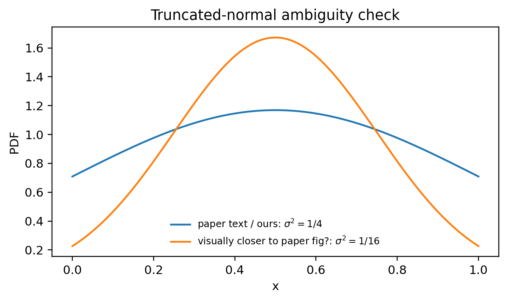

# Reproduction of *Tuning-free Estimation and Inference of Cumulative Distribution Function under Local Differential Privacy*

## Paper information

- **Title:** *Tuning-free Estimation and Inference of Cumulative Distribution Function under Local Differential Privacy*
- **Authors:** Yi Liu, Qirui Hu, and Linglong Kong
- **Venue:** Proceedings of the 41st International Conference on Machine Learning (**ICML 2024**), PMLR 235
- **Paper file in this repository:** `liu24z.pdf`

## Project overview

This repository reproduces the main methodology and the main numerical results of the paper above.

Since the official code is not publicly available, we implemented all code in this repository independently from scratch based on the paper.

The code implements:

1. **The LDP data collection mechanism** based on randomized response for the binary query
   $\Delta = \mathbf{1}_{\{X \le T\}}$.
2. **The constrained isotonic CDF estimator** from Algorithm 1 in the paper.
3. **Density-based sampling experiments** used for Table 1, Table 3, and Figure 4.
4. **Preselected sampling experiments** used for Figure 1 and Tables 4--6.
5. The plotting and table-generation scripts used to produce **Figures 1--4** and **Tables 1--7**.

The current repository is a **scaled but faithful reproduction** of the paper:
- the main estimator and experiment logic are reproduced successfully;
- the main qualitative conclusions of the paper are reproduced;
- a few paper/repository differences are documented clearly below.

## Repository contents

- `ldp_cdf.py`  
  Core implementation of the LDP mechanism and the constrained isotonic estimator.

- `distributions.py`  
  Distribution definitions used in the paper: Uniform, truncated normal, and Continuous Bernoulli.

- `experiments_density.py`  
  Runs the density-based sampling experiments and writes JSON results.

- `experiments_preselected.py`  
  Runs the preselected sampling experiments and writes JSON results.

- `plots.py`  
  Generates Figures 1--4.

- `tables.py`  
  Generates Tables 1--7 in both Markdown and LaTeX.

- `run_all.sh`  
  Recommended script for reproducing the current released results.

## Environment setup

### Requirements

- Python 3.10 or newer
- `numpy`
- `scipy`
- `matplotlib`

Install dependencies with:

```bash
pip install -r requirements.txt
```

## How to run the code

### Recommended: run the current full reproduction pipeline

The easiest way to reproduce the current project results is:

```bash
bash run_all.sh
```

This script generates:

- `fig1.png`
- `fig2.png`
- `fig3.png`
- `fig4.png`
- `table1.md/.tex`
- `table2.md/.tex`
- `table3.md/.tex`
- `table4.md/.tex`
- `table5.md/.tex`
- `table6.md/.tex`
- `table7.md/.tex`

It also saves the intermediate JSON files used to build those figures and tables.

### Run each part separately

#### 1. Density-based sampling: Figure 4 and Table 1

```bash
python experiments_density.py --G uniform \
  --n_list "1000,2000,5000,10000,20000,50000,100000,200000,500000,1000000,2000000,5000000,10000000" \
  --r_list "0.25,0.5,0.9" \
  --reps 2000 \
  --out density_results_fig4_dense.json

python plots.py figure4 --results density_results_fig4_dense.json --out fig4.png
```

To generate the Table 1 subset:

```bash
python tables.py table1 --results density_results_table1.json --out table1
```

#### 2. Density-based sampling with oracle \(G=F\): Table 3

```bash
python experiments_density.py --G oracle \
  --n_list "1000,10000,100000,1000000,10000000" \
  --r_list "0.25,0.5,0.9" \
  --reps 2000 \
  --out density_results_oracle.json

python tables.py table3 --results density_results_oracle.json --out table3
```

#### 3. Preselected sampling: Figure 1 and Table 4

```bash
python experiments_preselected.py \
  --n_list "1000,10000,100000,1000000,10000000" \
  --r_list "0.25,0.5,0.9" \
  --kappa_list 10 \
  --reps 2000 \
  --out preselected_results_k10.json

python plots.py figure1 --results preselected_results_k10.json --kappa 10 --out fig1.png
python tables.py table4 --results preselected_results_k10.json --out table4
```

#### 4. Preselected sampling: Tables 5 and 6

```bash
python experiments_preselected.py \
  --n_list "1000,10000,100000,1000000" \
  --r_list "0.25,0.5,0.9" \
  --kappa_list 20,30 \
  --reps 2000 \
  --out preselected_results_k2030.json

python tables.py table5 --results preselected_results_k2030.json --out table5
python tables.py table6 --results preselected_results_k2030.json --out table6
```

#### 5. Figure 2 and Figure 3

```bash
python plots.py figure2 --out fig2.png
python plots.py figure3 --n_list "1000,10000,100000,1000000" --r 0.5 --seed 1 --out fig3.png
```

#### 6. Table 2 and Table 7

```bash
python tables.py table2 --out table2
python tables.py table7 --n_list "1000,10000,100000,1000000,10000000" --reps 30 --out table7
```

## What results were reproduced successfully

### Successfully reproduced

We successfully reproduced the following parts of the paper:

1. **Core method**
   - The randomized-response privatization step is implemented correctly.
   - The constrained isotonic estimator is implemented as a weighted isotonic regression / PAVA solution, which is equivalent to the paper's GCM-based characterization.

2. **Figure 1 / Tables 4--6 (preselected sampling)**
   - The main trends are reproduced successfully.
   - As the sample size increases, the empirical **RCE** approaches 1 and the empirical **coverage** approaches 0.95, consistent with the paper's theoretical claims.

3. **Figure 4 / Tables 1 and 3 (density-based sampling)**
   - The main trends are reproduced successfully.
   - Errors decrease as the sample size increases.
   - Errors decrease as the privacy parameter \(r\) increases.
   - The oracle sampling baseline \(G=F\) behaves consistently with the paper.
   - Table 3 is reproduced particularly well.

4. **Figure 2 and Figure 3**
   - The repository reproduces the intended distribution plots and a single-run CDF estimation example.
   - The overall shapes and qualitative behavior match the paper.

5. **Table 2**
   - The conversion between $r$ and $\varepsilon$ is reproduced directly from the implemented formula.

6. **Table 7**
   - The runtime benchmark is reproduced as a computational reference.
   - Exact runtimes are machine-dependent, so only the general computational behavior should be compared to the paper.

## Important differences between this repository and the paper

The current repository matches the paper closely, but it is **not bit-for-bit identical** to the published experiments. The main differences are the following.

### 1. Number of repetitions

The paper reports results based on **10,000 repetitions** for the Monte Carlo experiments.

The current released reproduction uses:
- `REPS_DENSITY = 2000`
- `REPS_PRESELECTED = 2000`

This makes the experiments much more practical to run, while still preserving the paper's main trends.

### 2. Largest sample sizes are scaled down in some experiments

The current released scripts use:
- **Figure 1 / Table 4:** up to `n = 10^7`
- **Tables 5 and 6:** up to `n = 10^6`

So Tables 5 and 6 do **not** reach the paper's largest scale.

### 3. Eq. (6) in the paper is ambiguous

In `experiments_preselected.py`, the default implementation uses the **chi-square-consistent** version of WMSE:

```text
WMSE = n * sum(...)
```

rather than the literal `sqrt(n)` factor shown in the PDF typesetting of Eq. (6).

This choice was made because:
- it is consistent with the theorem in the paper;
- it is the only version that matches the paper's stated chi-square asymptotics;
- it reproduces the reported large-sample behavior of RCE and coverage.

The repository also includes an optional `literal_sqrtn` mode for checking the literal PDF formula, but the released results use `wmse_mode=chisq`.

### 4. Truncated normal distribution ambiguity in the paper

The repository currently implements the **paper-text definition** of the truncated normal distribution:

```text
X = Y/2 + 1/2, conditioned on |Y| < 1, where Y ~ N(0,1)
```

This corresponds to a truncated normal with mean `1/2` and variance `1/4` before truncation.

However, the paper's **Figure 2** and the **Table 1 truncated-normal column** appear visually/numerically closer to a narrower distribution, more consistent with variance `1/16`.

Because of this, the current code reproduces the paper text literally, but some truncated-normal values in Table 1 differ systematically from the published values.


### 5. Figure 2 caption text and the actual plot are swapped in the paper

In the appendix, the paper caption text says Figure 2 is:

```text
Left: Plot of CDF, Right: Plot of PDF
```

but the actual axes in the figure are the opposite:
- left panel is `f(x)` (PDF)
- right panel is `F(x)` (CDF)

The code in `plots.py` follows the **actual figure axes**, not the caption wording.

### 6. Finite-grid numerical evaluation

For density-based experiments, MAE and $L_2$ error are computed on a finite evaluation grid (`grid_size=2001` by default), and the $L_2$ term is approximated numerically. This does not affect the main conclusions, but it may create very small numerical differences relative to the paper.

## Recommended interpretation of the reproduction

Our conclusion is:

- the **methodology is reproduced successfully**;
- the **main experimental trends are reproduced successfully**;
- most remaining discrepancies come from either
  - scaled-down run settings, or
  - ambiguities/inconsistencies in the published paper itself.

## Output files

After running `bash run_all.sh`, the most important outputs are:

- `fig1.png`: preselected sampling, RCE and coverage
- `fig2.png`: PDF/CDF of the three distributions
- `fig3.png`: one-run estimation example
- `fig4.png`: density-based sampling error curves
- `table1.md/.tex`: density-based sampling, uniform `G`
- `table2.md/.tex`: conversion between `r` and `ε`
- `table3.md/.tex`: density-based sampling, oracle `G=F`
- `table4.md/.tex`: preselected sampling, `κ=10`
- `table5.md/.tex`: preselected sampling, `κ=20`
- `table6.md/.tex`: preselected sampling, `κ=30`
- `table7.md/.tex`: runtime benchmark

## Citation

If you use this repository, please cite the original paper.
